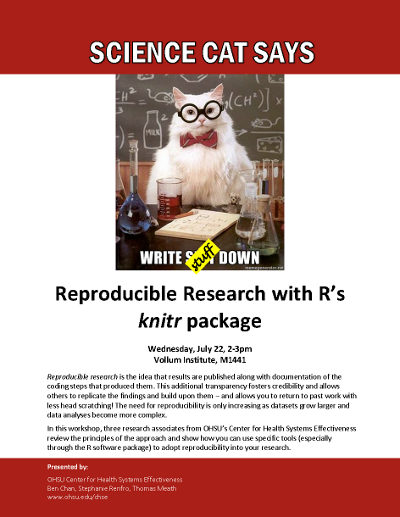
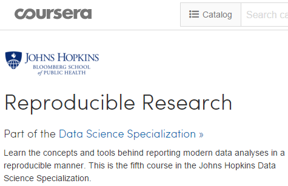
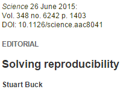
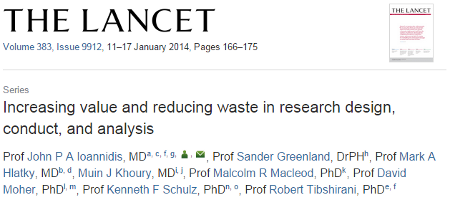
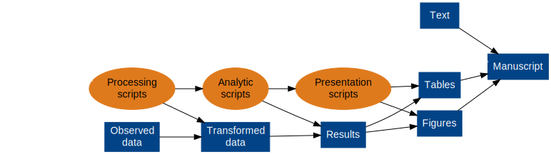
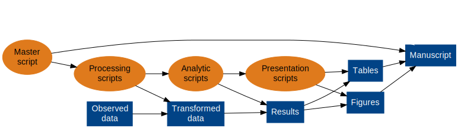

## Outline {.columns-2}

1. Introduction (Ben)
2. Walkthrough a toy example (Stephanie)
3. Getting fancy (Thomas)
4. Outro (Ben)




## Introduction {.columns-2}

1. **What** is reproducible research?
2. **Why** reproducible research?
3. **How** to do reproducible research?


## What? {.columns-2}

RR is **open sourcing** your project

* Reproducible research is the idea that data analyses... **are published with their data and software code** so that others may verify the findings and build upon them
* Reproducibility makes an analysis more useful to others because the data and **code that actually conducted the analysis are available**

[](https://www.coursera.org/course/repdata)


## What? {.columns-2}

One of the most effective ways to promote high-quality science is to create free open-source tools that give scientists easier and cheaper ways to incorporate transparency into their daily workflow: 

* from **open** ~~lab notebooks~~ **code libraries**, 
* to **dynamic document generation**,

[](http://www.sciencemag.org/content/348/6242/1403.full)


## Why?

It's where we're all headed...

* Funding mandates
    * [Principles and Guidelines for Reporting Preclinical Research (*NIH*)](http://www.nih.gov/science/reproducibility/principles-guidelines.htm)
    * [Policy: NIH plans to enhance reproducibility (*Nature*)](http://www.nature.com/news/policy-nih-plans-to-enhance-reproducibility-1.14586)
* Journal mandates
    * [Transparency and Openness Promotion (TOP) Guidelines](http://centerforopenscience.org/top/)
    * As of 2015-07-21, **200** [journal signatories](http://centerforopenscience.org/top/#journals)
* Best practices


## Why? {.columns-2 .smaller}

Reward systems are changing...

* Important to **reward scientists on the basis** of good quality of research and documentation, and **reproducibility of results**, rather than statistical significance
* Statistical shops could adopt software systems that **encourage accuracy and reproducibility of their software scripts** [e.g., *knitr*]
* **Public availability** of raw data and **complete scripts of statistical analyses** could be required by journals and funding agencies sponsoring new research --- e.g., as the IOM recommended in a report on omics  

[](http://www.sciencedirect.com/science/article/pii/S0140673613622278)


## Why?

Transparency and Openness Promotion [(TOP) Guidelines'](http://centerforopenscience.org/top/) 8 standards:

1. Citation standards
2. Data transparency
3. **Analytic methods (code) transparancy**
4. Research materials transparency
5. Design and analysis transparency
6. Preregistration of studies
7. Preregistration of anlaysis plans
8. Replication


## Why?

[ 1422-5, partial scaled.png)](http://www.sciencemag.org/content/348/6242/1422.full)


## Why?

Best practices

* Break us out of bad habits
* Make your code more *human-readable* (without being less machine-readable)
* Track decision points
* Minimize impact of staff turnover
* Disaster mitigation
* Projects become more open and transparent


## How?

```{r, eval=TRUE, echo=FALSE, results='hide', message=FALSE, warning=FALSE}
source("makePipelineDiagrams.R")
```

Almost reproducible research pipeline




## How?

Fully reproducible research pipeline




## How?

* Today, we're going to focus on **R**
* Tools for **SAS** and **Stata** are not mature 
    * Unclear if there are active development efforts to build them
    * However, principles are the same


## How?

Now, some examples...


## Outro

[Real example](MASTER.html) of a data processing pipeline.


## Outro

Resources to get you started

1. Johns Hopkins [Coursera course](https://www.coursera.org/course/repdata)
2. [R Markdown](http://rmarkdown.rstudio.com/) authoring format
3. [Dynamic Documents with R and knitr](https://www.crcpress.com/Dynamic-Documents-with-R-and-knitr-Second-Edition/Xie/9781498716963)
3. [Reproducible Research with R and R Studio](http://christophergandrud.github.io/RepResR-RStudio/)
3. [Implementing Reproducible Research](https://osf.io/s9tya/wiki/home/)
2. [CHSE](http://www.ohsu.edu/xd/research/centers-institutes/center-for-health-systems-effectiveness/)
