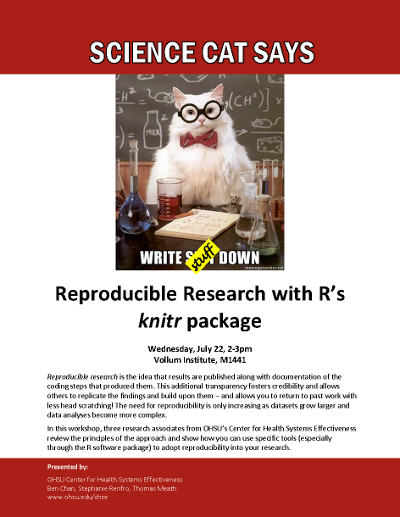

# Reproducible Research with R's *knitr* package
| Center for Health Systems Effectiveness ([CHSE](http://www.ohsu.edu/xd/research/centers-institutes/center-for-health-systems-effectiveness/))
| Benjamin Chan (chanb@ohsu.edu)
| Stephanie Renfro (renfrst@ohsu.edu)
| Thomas Meath (meath@ohsu.edu)
  
July 22, 2015  

## Outline {.columns-2}

1. Introduction (Ben)
2. Example and workflow (Stephanie)
3. Getting fancy (Thomas)

## Introduction {.columns-2}

1. **What** is reproducible research?
2. **Why** reproducible research?
3. **How** to do reproducible research?

## What is reproducible research?

It's where we're all headed...

* Journal mandates
    * [Transparency and Openness Promotion (TOP) Guidelines](http://centerforopenscience.org/top/)
    * As of 2015-07-08, 115 [journal signatories](http://centerforopenscience.org/top/#journals)
* Funding mandates (NIH)
    * [Principles and Guidelines for Reporting Preclinical Research (*NIH*)](http://www.nih.gov/science/reproducibility/principles-guidelines.htm)
    * [Policy: NIH plans to enhance reproducibility (*Nature*)](http://www.nature.com/news/policy-nih-plans-to-enhance-reproducibility-1.14586)
* Mainstream press
    * [Journal Science releases guidelines for publishing scientific studies (*NY Times*)](http://www.nytimes.com/2015/06/26/science/journal-science-releases-guidelines-for-publishing-scientific-studies.html)
    * [Trouble at the lab (*The Economist*)](http://www.economist.com/news/briefing/21588057-scientists-think-science-self-correcting-alarming-degree-it-not-trouble)

## What is reproducible research?

[Transparency and Openness Promotion (TOP) Guideline's](http://centerforopenscience.org/top/) 8 standards:

1. Citation standards
2. Data transparency
3. **Analytic methods (code) transparancy**
4. Research materials transparency
5. Design and analysis transparency
6. Preregistration of studies
7. Preregistration of anlaysis plans
8. Replication

## What is reproducible research? {.columns-2}

* Reproducible research is the idea that data analyses... **are published with their data and software code** so that others may verify the findings and build upon them
* Reproducibility makes an analysis more useful to others because the data and **code that actually conducted the analysis are available**

RR is **open sourcing** your project

## Why reproducible research? {.columns-2}

One of the most effective ways to promote high-quality science is to create free open-source tools that give scientists easier and cheaper ways to incorporate transparency into their daily workflow: 

* from **open lab notebooks**, 
* to software that tracks every version of a data set (topic for another day), 
* to **dynamic document generation**

## Why reproducible research? {.columns-2 .smaller}

Reproducibility practices and reward systems

* Important to **reward scientists on the basis** of good quality of research and documentation, and **reproducibility of results**, rather than statistical significance
* Statistical shops could adopt software systems that **encourage accuracy and reproducibility of their software scripts** [e.g., *knitr*]
* **Public availability** of raw data and **complete scripts of statistical analyses** could be required by journals and funding agencies sponsoring new research --- e.g., as the IOM recommended in a report on omics  

## Why reproducible research?

[ 1422-5, partial scaled.png)](http://www.sciencemag.org/content/348/6242/1422.full)

## How to do reproducible research?

Almost reproducible research pipeline

## How to do reproducible research?

Fully reproducible research pipeline

## How to do reproducible research?

Now, some examples...
