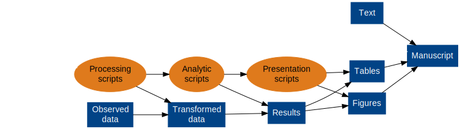
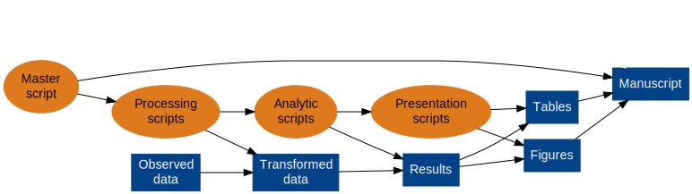

## Outline {.columns-2}

1. Introduction
2. Example and workflow
3. Getting fancy


## Introduction {.columns-2}

1. What is reproducible research?
2. Why reproducible research?
3. How to do reproducible research?


## What is reproducible research?

Peng, Leek, and Caffo, [Reproducible Research on Coursera](https://www.coursera.org/course/repdata)

* Reproducible research is the idea that data analyses... **are published with their data and software code** so that others may verify the findings and build upon them
* Reproducibility makes an analysis more useful to others because the data and code that actually conducted the analysis are available

This is just one aspect of *reproducible research*.

In other words, *open source* for your research project.


## Why reproducible research? {.columns-2}

One of the most effective ways to promote high-quality science is to create free open-source tools that give scientists easier and cheaper ways to incorporate transparency into their daily workflow: 

* from open lab notebooks, 
* to software that tracks every version of a data set, 
* to **dynamic document generation**

[](http://www.sciencemag.org/content/348/6242/1403.full)


## Why reproducible research? {.columns-2}

* Important to **reward scientists on the basis of good quality of research and documentation, and reproducibility of results**, rather than statistical significance
* Statistical shops could adopt software systems that **encourage accuracy and reproducibility of their software scripts** [e.g., *knitr*]
* **Public availability** of raw data and **complete scripts of statistical analyses** could be required by journals and funding agencies sponsoring new research --- e.g., as the IOM recommended in a report on omics

[](http://www.sciencedirect.com/science/article/pii/S0140673613622278)


## Why reproducible research?

[ 1422-5, partial scaled.png)](http://www.sciencemag.org/content/348/6242/1422.full)


## Why reproducible research?

Although much of the focus on reproducibility is at the basic and preclinical research level, reproducibility is where we're all headed.

* [Principles and Guidelines for Reporting Preclinical Research (*NIH*)](http://www.nih.gov/science/reproducibility/principles-guidelines.htm)
* [Policy: NIH plans to enhance reproducibility (*Nature*)](http://www.nature.com/news/policy-nih-plans-to-enhance-reproducibility-1.14586)
* [Trouble at the lab (*The Economist*)](http://www.economist.com/news/briefing/21588057-scientists-think-science-self-correcting-alarming-degree-it-not-trouble)


## How to do reproducible research?

```{r, echo=FALSE, results='hide', message=FALSE, warning=FALSE}
source("makePipelineDiagrams.R")
```

Standard research pipeline


## How to do reproducible research?

Almost reproducible research pipeline




## How to do reproducible research?

Fully reproducible research pipeline




## How to do reproducible research?

Now, some examples...
